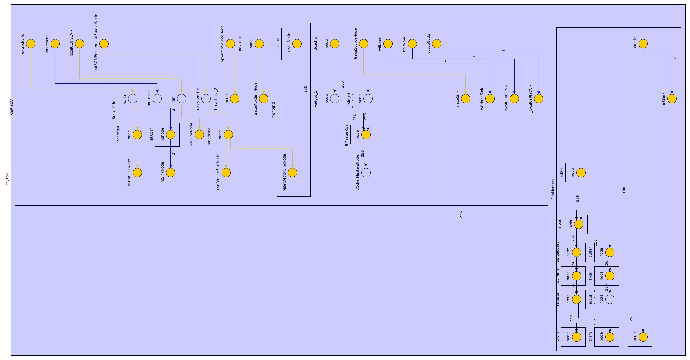

RocketTile
=======================
A simple instance of a RockeTile with an example RoCC accelerator.

This project uses [playground](https://github.com/morphingmachines/playground.git) as a library. `playground` and this project directories should be at the same level, as shown below.  
```
  workspace
  |-- playground
  |-- RocketTile
```
Make sure that you have a working [playground](https://github.com/morphingmachines/playground.git) project before proceeding further. Do not rename/modify `playground` directory structure.
## Clone the code
```sh
git clone --recursive git@github.com:morphingmachines/RocketTile.git
```

## Generating Verilog

Verilog code can be generated from Chisel by using the `rtl` Makefile target.

```sh
make rtl
```

The output verilog files are generated in the `./generated_sv_dir` directory. This also generates a `graphml` file that visualizes the diplomacy graph of different components in the system. To view `graphml` file, as shown below, use [yEd](https://askubuntu.com/a/504178).


## Simulator

 We assume [Spike RISCV-V ISA Simulator](https://github.com/riscv-software-src/riscv-isa-sim) is installed and `RISCV` environment variable is set to the Spike install path. The test bench setup uses Front-End Server (FESVR), a C++ library that manages communication between a host machine and a RISC-V DUT, which is part of the [Spike](https://github.com/riscv-software-src/riscv-isa-sim) build.

Simulator executable can be generated using the `verilate` Makefile target.

```sh
make verilate
```

This will generate an executable `generated_sv_dir/ce.sim.SimDUT/obj_dir/VTestHarness` that can take an `elf` file and generate instruction trace.

More targets can be listed by running `make`

## Bare-metal Examples

`src/main/resources/baremetal` includes examples programs that can be used to run the simulation. `RISCV_TESTS_SRC` environment variable must be set to [riscv-tests](https://github.com/riscv-software-src/riscv-tests.git) path, required for `riscv_test.h` file.

#### Run `vecAdd` program on the simulator
```sh
cd src/main/resources/baremetal/vecAdd
make run
```
