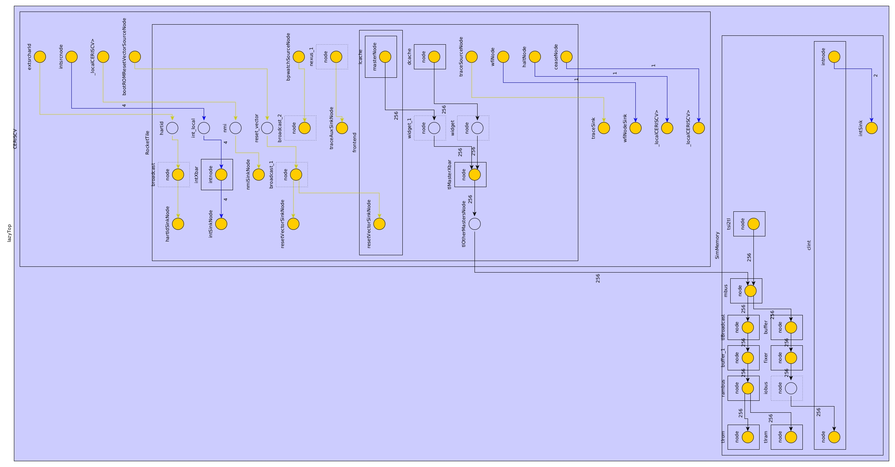

RocketTile
=======================
A simple instance of a RockeTile with an example RoCC accelerator.

This project uses [playground](https://github.com/morphingmachines/playground.git) as a library. `playground` and this project directories should be at the same level, as shown below.  
```
  workspace
  |-- playground
  |-- RocketTile
```
Make sure that you have a working [playground](https://github.com/morphingmachines/playground.git) project before proceeding further. Do not rename/modify `playground` directory structure.
## Clone the code
```sh
git clone --recursive git@github.com:morphingmachines/RocketTile.git
```

## Generating Verilog

Verilog code can be generated from Chisel by using the `rtl` Makefile target.

```sh
make rtl
```

The output verilog files are generated in the `./generated_sv_dir` directory. This also generates a `graphml` file that visualizes the diplomacy graph of different components in the system. To view `graphml` file, as shown below, use [yEd](https://askubuntu.com/a/504178).


## Simulator
To run simulations, you need to install the following [dependencies](./doc/dependencies.md)

 We assume [Spike RISC-V ISA Simulator](https://github.com/riscv-software-src/riscv-isa-sim) is installed and `RISC-V` environment variable is set to the Spike install path. The test bench setup uses Front-End Server (FESVR), a C++ library that manages communication between a host machine and a RISC-V DUT, which is part of the [Spike](https://github.com/riscv-software-src/riscv-isa-sim) build.

`LD_LIBRARY_PATH` must be set to `libriscv.so` path, part of the [rocket-tools](./doc/dependencies.md) install (`$RISCV/lib`).

```sh
export LD_LIBRARY_PATH=$RISCV/lib:$LD_LIBRARY_PATH
```

* The simulator executable can be generated using `make verilate`.

```sh
make verilate
```

This will generate an executable `generated_sv_dir/ce.sim.SimDUT/obj_dir/VTestHarness`, that can take an `elf` file and generate an instruction execution trace.

More targets can be listed by running `make`

## Sanity check with bare-metal examples

`src/main/resources/baremetal` includes example programs (`vecAdd`, `rocc-example`, `assembly-example`) that can be used to run the simulation. `RISCV_TESTS_SRC` environment variable must be set to [riscv-tests](https://github.com/riscv-software-src/riscv-tests.git) path, required for `riscv_test.h` file.

#### Run `vecAdd` program on the simulator
```sh
cd src/main/resources/baremetal/vecAdd
make run
```

#### Run `vecAddD` program on the simulator (RV32D — double-precision FPU)
```sh
cd src/main/resources/baremetal/vecAddD
make run
```

`vecAddD` uses `RV32DConfig` (`CEConfigRV32D`): `xLen=32`, `fLen=64` (double-precision FPU). Key config parameters required for correct simulation:

```scala
DCacheParams(
  nMSHRs      = 0,        // blocking DCache (DCache.scala) — required for RV32D correctness
  subWordBits = Some(32), // split SRAM at 32-bit granularity (8 lanes × 32-bit)
)
```

**Why these parameters matter**: with `fLen=64`, `coreDataBits = max(xLen, fLen) = 64`. The non-blocking DCache (`nMSHRs > 0`) uses 64-bit SRAM lanes with no sub-lane byte enables. A 32-bit `sw` to `tohost` followed by `sw zero, tohost+4` both map to the same 64-bit lane — the second store zeroes the first, preventing simulation exit. Setting `nMSHRs=0` selects the blocking `DCache`, which respects `subWordBits=32` and splits the SRAM into 32-bit lanes, eliminating the collision. See `src/main/resources/baremetal/vecAddD/diagnosis/bug_report.md` for the full diagnosis.
